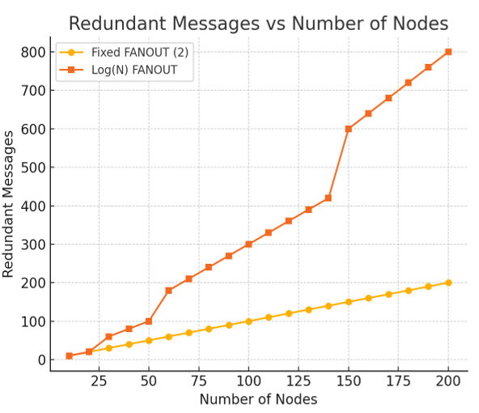
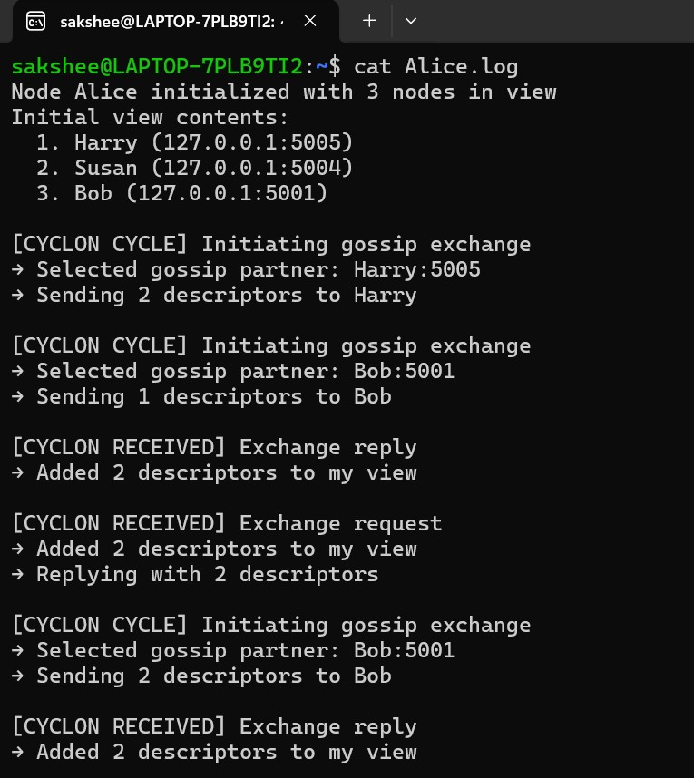
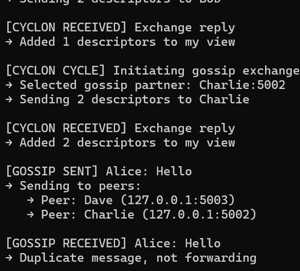

# Cyclon-Enhanced Gossip Protocol in C

A UDP-socket implementation and empirical comparison of traditional gossip vs. **Cyclon**, a structured peer-sampling protocol, run across 6 distributed processes. Includes derived, regression-fitted models for message redundancy and live logs proving the peer-sampling mechanism works as designed.

## TL;DR

- Implemented both a naive gossip protocol and Cyclon in C using raw UDP sockets
- Simulated across 6 independent processes communicating over loopback
- Derived closed-form redundancy equations and fit them against simulation data via linear regression
- **Result:** Cyclon achieves high reachability at a fraction of the message overhead of naive gossip at scale

## Comparative Analysis


| Strategy | Redundancy Model | Behavior |
|---|---|---|s
| Fixed fanout (2) | `R ≈ N` | Low redundancy, but poor reachability at scale that is random peer selection without seeding means some nodes never get reached |
| Log(N) fanout | `R ≈ 0.73·N·log₂N` | High reachability, but redundancy grows superlinearly |
| **Cyclon** | Bounded, structured | High reachability **and** low redundancy that us the structured partial-view exchange avoids the tradeoff above |

The `0.73` constant was obtained by fitting a linear regression model to simulated redundant-message counts as node count scaled from 10 to 200.

## The Redundancy vs. Reachability Tradeoff (and why Cyclon fits)

This is the core question the project set out to answer: **in a decentralized network, how do you make sure a message reaches every node without flooding the network with duplicates?**

**Fixed low fanout (e.g. 2 peers per node):** Redundancy stays low that is roughly R ≈ N extra messages — but reachability suffers badly as the network grows. Since peer selection is random and unseeded, the same handful of nodes can keep getting picked while others are never reached at all. This gets worse as node count increases, because the odds of every node being hit by pure chance drop off fast.

**High/log(N) fanout:** Reachability improves a lot that is nearly every node gets the message but redundancy balloons to R ≈ 0.73·N·log₂N, meaning the network is doing far more work than necessary. Each additional node makes this worse, since the fanout itself grows with network size on top of the node count growing.

**Neither extreme is good enough at scale.** A small fanout wastes reachability; a large fanout wastes bandwidth. This is exactly the gap Cyclon is designed to close.

**How Cyclon resolves it:** Instead of picking random peers fresh every cycle, each node keeps a small, structured, constantly-refreshed partial view of the network (via descriptor exchange with its oldest-known peer each cycle). This means:

- Peer contacts stay diverse over time without needing a large fanout per message — reachability comes from the view *refreshing itself*, not from contacting more peers per cycle
- Because the view is bounded and age-managed, no peer gets contacted excessively or neglected — avoiding both the "stuck with the same peers" problem of low fanout and the "contact everyone" waste of high fanout
- The overlay self-organizes toward randomness over time, which is what actually drives high reachability, rather than brute-forcing it with fanout size


In short: **Cyclon decouples reachability from message overhead**, which is the fundamental tradeoff traditional gossip can't escape. That's the main result this project set out to demonstrate, and the logs below show it happening in a live run.

## How Cyclon Works

Each node maintains a small, fixed-size partial view of the network that is a set of **descriptors** (peer ID, address, timestamp). Every gossip cycle:

1. The node picks the **oldest** descriptor in its view and initiates an exchange with that peer
2. Both nodes swap a random subset of their descriptors, including a fresh descriptor of themselves
3. Stale entries get replaced with newer, randomly-sourced ones

This produces continuous, self-organizing reconfiguration of the overlay network — no central coordinator, no fixed topology.

**Properties:**
- **Scalable** — bounded per-node state regardless of network size
- **High reachability** — uniform dissemination paths, unlike naive random fanout
- **Robust to churn** — randomization means no single node's failure meaningfully disrupts the overlay
- **Self-stabilizing** — in-degree and out-degree converge toward the configured view size over time

## Why It Beats Naive Gossip

Naive gossip forwards messages to a random subset of peers with no awareness of network state in order to get good reachability you need a high fanout, and that directly means high redundancy (nodes seeing the same message repeatedly). Cyclon sidesteps this because peer selection isn't purely random per-message as it's driven by a **constantly refreshed, bounded view**, so message forwarding paths stay diverse without needing a large fanout. Age-based eviction means no peer gets stale or over-contacted.

## Proof of Execution

6 nodes (Alice, Bob, Charlie, Dave, Susan, Harry) were run as separate processes on loopback. Excerpt from `Alice.log`:

```
Node Alice initialized with 3 nodes in view
Initial view contents:
  1. Harry (127.0.0.1:5005)
  2. Susan (127.0.0.1:5004)
  3. Bob (127.0.0.1:5001)

[CYCLON CYCLE] Initiating gossip exchange
→ Selected gossip partner: Harry:5005
→ Sending 2 descriptors to Harry

[CYCLON RECEIVED] Exchange reply
→ Added 2 descriptors to my view

[CYCLON CYCLE] Initiating gossip exchange
→ Selected gossip partner: Charlie:5002   <- Charlie was NOT in the initial view
→ Sending 2 descriptors to Charlie
```

This confirms the core mechanism: nodes end up gossiping with peers that weren't in their original view, proving the descriptor-swapping and view-refresh logic works correctly across a live, distributed run — not just in theory.

A plain-text message typed into any terminal mid-run propagates to all peers via the current views, with duplicate detection preventing re-forwarding. This is also visible in the logs.

## Screenshots from the live 6-node run:

|  |  |

## Project Structure

```
gossip_baseline.c   # Traditional fixed/log(N)-fanout gossip
gossip_cyclon.c      # Cyclon-enhanced structured gossip
users.txt            # Peer registry: <name> <ip> <port>
```

`users.txt`:
```
Alice 127.0.0.1 5000
Bob   127.0.0.1 5001
Charlie 127.0.0.1 5002
Dave  127.0.0.1 5003
Susan 127.0.0.1 5004
Harry 127.0.0.1 5005
```

## Running It

Each entry in `users.txt` needs its own terminal, running the same binary bound to its own port. For 6 users, open 6 terminals:

```bash
gcc gossip_cyclon.c -o cyclon
./cyclon <port_number>   # e.g. ./cyclon 5000 for Alice
```

Once all 6 are running:
- Type any message into a terminal → it gossips out to that node's current view and propagates across the network
- `VIEW` → print the node's current partial view
- `CYCLE` → force an immediate gossip cycle instead of waiting for the timer
- `BYE` → disconnect the node

Pipe output to a log file to observe behavior after the fact: `./cyclon 5000 | tee Alice.log`

## References

[1] S. Voulgaris, D. Gavidia, and M. van Steen, "CYCLON: Inexpensive Membership Management for Unstructured P2P Overlays," *Journal of Network and Systems Management*, vol. 13, no. 2, pp. 197–217, June 2005.

[2] A. Antonov and S. Voulgaris, "SecureCyclon: Dependable Peer Sampling," in *2023 IEEE 43rd International Conference on Distributed Computing Systems (ICDCS)*, 2023, pp. 380–391.
